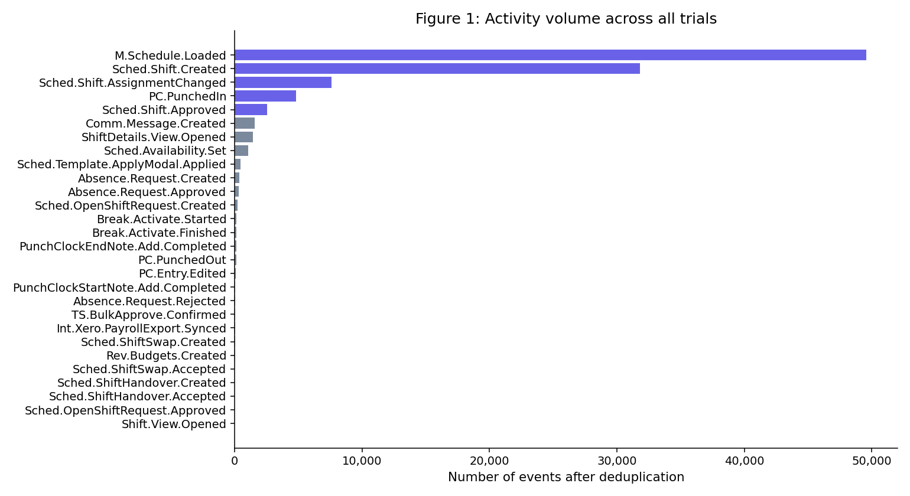
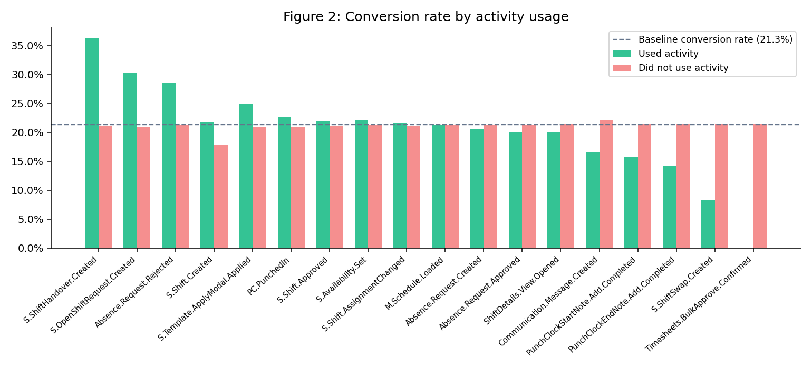
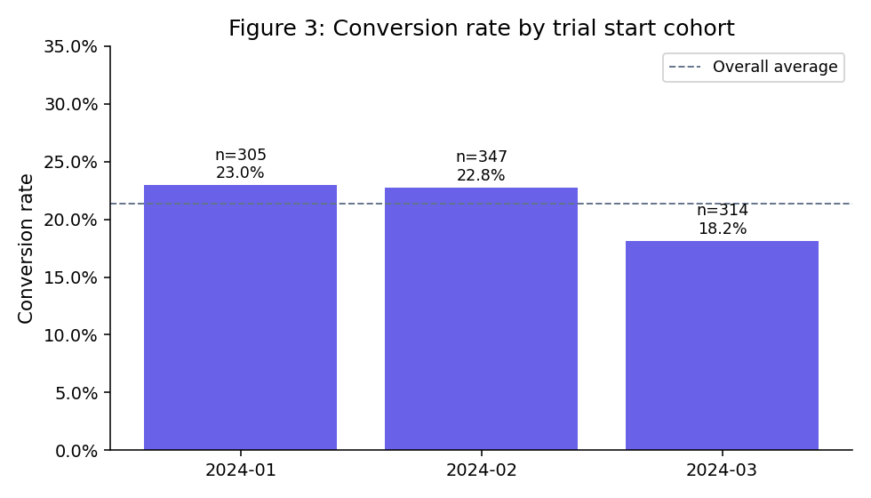
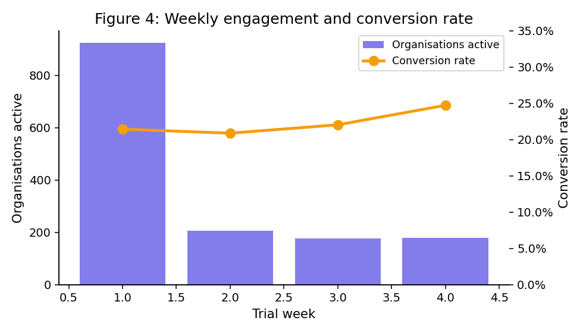
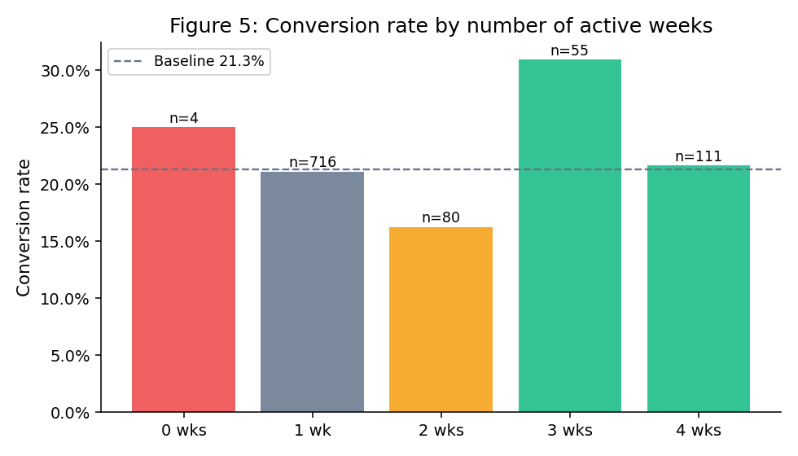
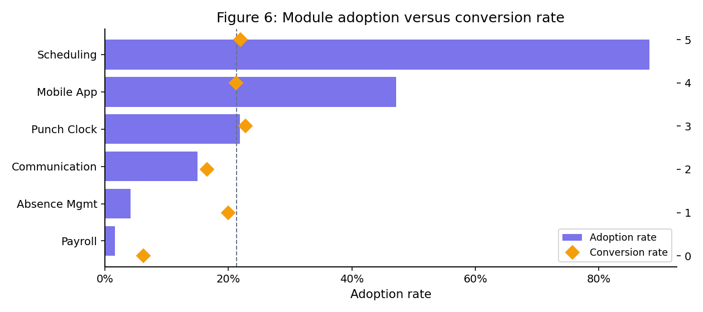
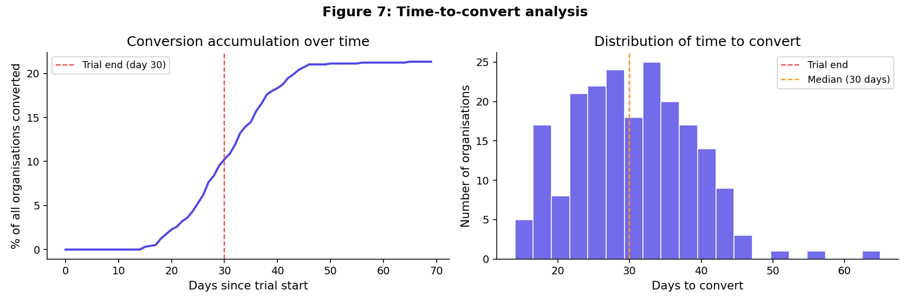
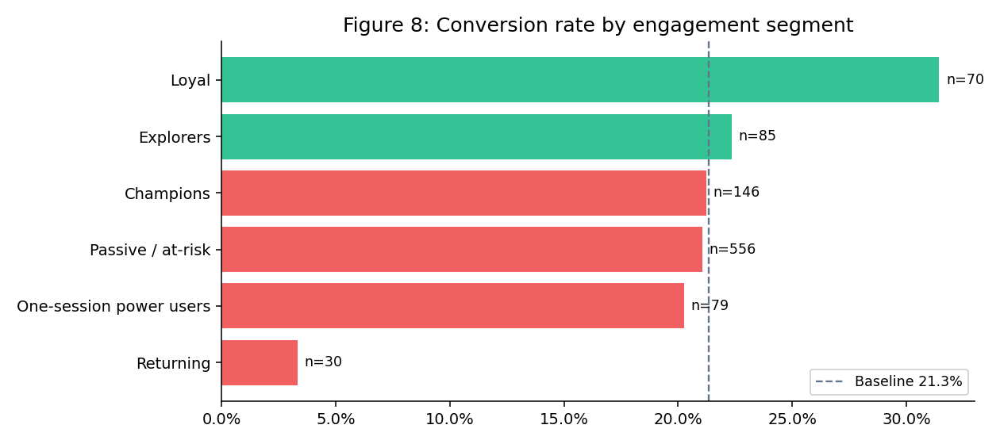
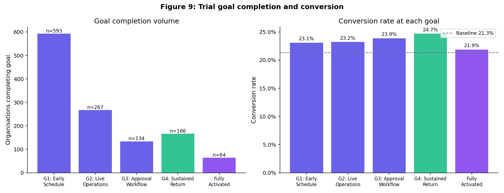

# Splendor Analytics — Trial Activation Challenge

**Submitted by:** Chukwuebuka Jeremiah Enoch | [@EnochJeremiah6]

---

## The Problem

Splendor Analytics runs a 30-day free trial for its workforce management platform. About 1 in 5 organisations later convert to a paid plan.

The issue is that the team cannot clearly tell:

* which organisations are likely to convert
* when they should step in during the trial
* what product behaviour actually matters

In this project, I focused on understanding what is really happening during the trial and how to track meaningful usage.

---

## What I Found

| Finding                | Detail                                             |
| ---------------------- | -------------------------------------------------- |
| **Conversion rate**    | 21.3% across 966 organisations                     |
| **No clear predictor** | No single activity strongly explains conversion    |
| **Main reason**        | 51.9% of conversions happen after the trial ends   |
| **Best signal**        | Orgs active in 3+ weeks convert at 30.9%           |
| **Biggest issue**      | Huge drop from Week 1 to Week 2                    |
| **Week 4 matters**     | Orgs still active late in the trial perform better |
| **Messaging insight**  | Lower conversion, likely used when issues come up  |

---
## Key Findings Visualized


**Shift creation dominates all activity.** After removing 67,631 duplicate 
rows, Scheduling.Shift.Created accounts for the majority of events, confirming 
that scheduling is the core entry point to the platform. The top 5 activities 
are highlighted; everything else is secondary.

---


**No single activity is a magic conversion lever.** For every activity, we 
compared the conversion rate of orgs that used it vs those that didn't. 
None of the differences are statistically significant (all p > 0.05). This is 
an honest and important finding, conversion is driven by depth of engagement, 
not any one action.

---


**Conversion rate is stable across cohorts.** Organisations that started their 
trial in January, February, and March 2024 all converted at roughly the same 
rate (~21–23%). This rules out seasonality as a factor and confirms the 
dataset is consistent across the full period.

---


**The Week 1 → Week 2 cliff is the biggest problem in the funnel.** 95.7% of 
organisations are active in Week 1, but only 21.3% return in Week 2, a 78% 
drop. Fixing this single transition is more impactful than optimising any 
individual feature.

---


**Multi-week engagement is the strongest conversion signal in the data.** 
Organisations active in 3 trial weeks convert at 30.9%, the highest of any 
segment and 1.45x the 21.3% baseline. This finding directly shaped Goal 4 
of our Trial Activation definition.

---


**Scheduling is near-universal but most modules are underused.** While 88.2% 
of orgs use scheduling, only 47.2% use the mobile app and 21.8% use the punch 
clock. Notably, the Communication module correlates negatively with conversion 
(16.6% CR), likely because struggling orgs use it for support escalation.

---


**Conversion is a post-trial decision, not an in-trial one.** Zero 
organisations convert in the first 14 days. 51.9% convert after the trial 
ends entirely. This structural finding explains why our ML models score near 
random (AUC ~0.52), the conversion decision is driven by post-trial sales 
and procurement processes invisible in the behavioural log.

---


**The 'Loyal' segment is the highest-value group.** Using RFM-style 
segmentation (recency, frequency, breadth of activity), the Loyal segment, 
organisations active across multiple weeks with varied feature usage,
converts at 31.4%, 1.47x the baseline. The 'Returning' segment paradoxically 
converts at only 3.3%, suggesting passive re-visits without real engagement 
do not signal intent.

---


**Trial Activation is achieved by completing all four goals.** The left chart 
shows how many organisations completed each goal. The right chart shows the 
conversion rate at each goal, all above baseline, with Goal 4 (sustained 
return) showing the highest lift at 1.16x. 64 organisations (6.6% of the 
cohort) achieved full Trial Activation.

## Trial Activation Definition

I defined Trial Activation as completing four key behaviours during the trial:

| Goal                      | Definition                                                            | Completion Rate | CR    | Lift  |
| ------------------------- | --------------------------------------------------------------------- | --------------- | ----- | ----- |
| **G1 – Early Setup**      | Create at least 2 shifts within first 3 days                          | 61.4%           | 23.1% | 1.08x |
| **G2 – Real Usage**       | View mobile schedule and perform an action (punch-in or shift change) | 27.6%           | 23.2% | 1.09x |
| **G3 – Approval Flow**    | Approve at least 2 shifts                                             | 13.9%           | 23.9% | 1.12x |
| **G4 – Keep Coming Back** | Active in at least 3 different weeks                                  | 17.2%           | 24.7% | 1.16x |

**Fully Activated:** 64 organisations (6.6%)

These steps follow how the product is meant to be used:
Set up → Use → Approve → Return

These are not perfect predictors, just a practical way to track meaningful usage.

---

## Repo Structure

```text
splendor_challenge/
├── notebooks/
│   └── analysis.py
├── sql/
│   ├── staging/
│   ├── marts/
│   └── dbt_project/
├── outputs/
├── data/
├── README.md
└── requirements.txt
```

---

## What I Did

### 1. Data Cleaning and Preparation

* Loaded the raw dataset
* Converted date columns properly
* Checked for missing values
* Removed duplicate rows
* Filtered events to stay within the 30-day trial
* Created new fields like:

  * days_into_trial
  * trial_week
  * module

I also built an organisation-level dataset with things like:

* total activity
* number of features used
* active days
* weeks active
* time to convert

---

### 2. Analysis

I explored the data using charts and summaries, including:

* activity volume
* conversion by activity
* cohort trends
* weekly retention
* weeks active vs conversion
* module usage
* time to convert
* engagement segments
* trial goal completion

---

### 3. Conversion Driver Checks

I tested different ways to see what might explain conversion:

* Chi-square tests
* Mann-Whitney test
* Logistic Regression
* Random Forest
* Behaviour-based segmentation

All of them pointed to the same thing:

There is no strong in-trial behaviour that clearly predicts conversion.

The main reason is simple:
Many organisations convert after the trial ends, so the decision is likely influenced by things outside the product.

---

### 4. Trial Goals

Since the data does not give a clear predictor, I defined trial goals based on how the product should be used.

The idea is:

* start using it properly
* use it in real work
* complete workflows
* keep returning

This gives a better way to track activation even if conversion itself happens later.

---

### 5. SQL Models

I built SQL models (dbt-style) to track:

* cleaned trial events
* organisation-level summaries
* goal completion
* activation status

This makes it easier to monitor behaviour in a structured way.

---

## Outputs

The script generates:

* charts (PNG files)
* cleaned datasets
* model outputs

All saved in the `outputs/` folder.

---

## Key Insights

1. Conversion mostly happens after the trial
   This means product usage alone cannot explain it

2. The biggest problem is early drop-off
   Most users do not come back after Week 1

3. Consistent usage matters more than heavy one-time use

4. Mobile activity likely shows real team usage

5. Messaging may indicate struggling users rather than engaged ones

---

## How to Run

### Python

```bash
pip install -r requirements.txt

cd notebooks
python analysis.py
```

---

### SQL (DuckDB)

```python
import duckdb, pandas as pd

con = duckdb.connect()
df = pd.read_csv("data/Copy of DA task.csv")
con.register("raw__trial_events", df)
```

Run SQL models in order:

1. staging
2. organisation summary
3. goals
4. activation

---

## Requirements

See `requirements.txt`
